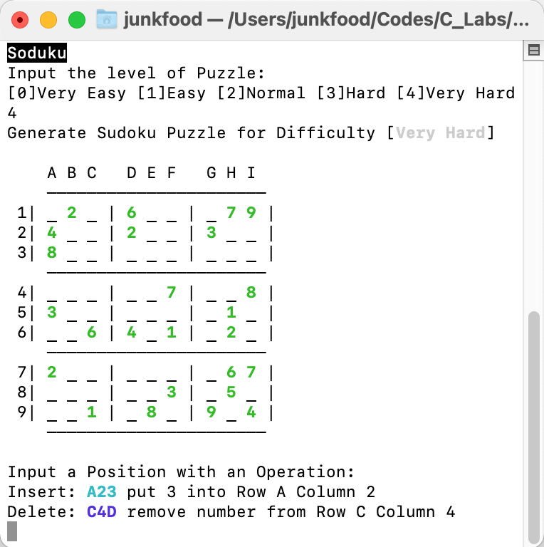
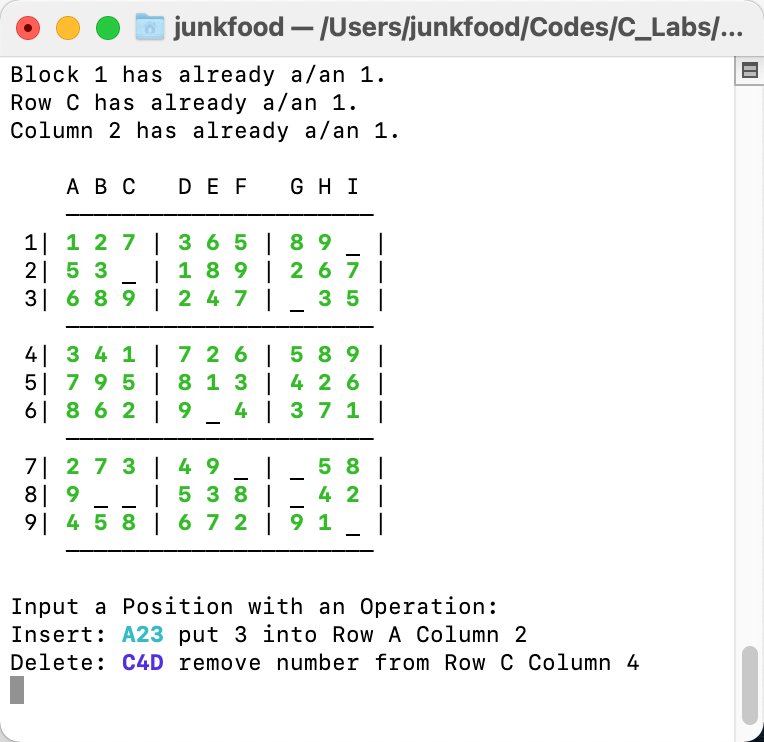
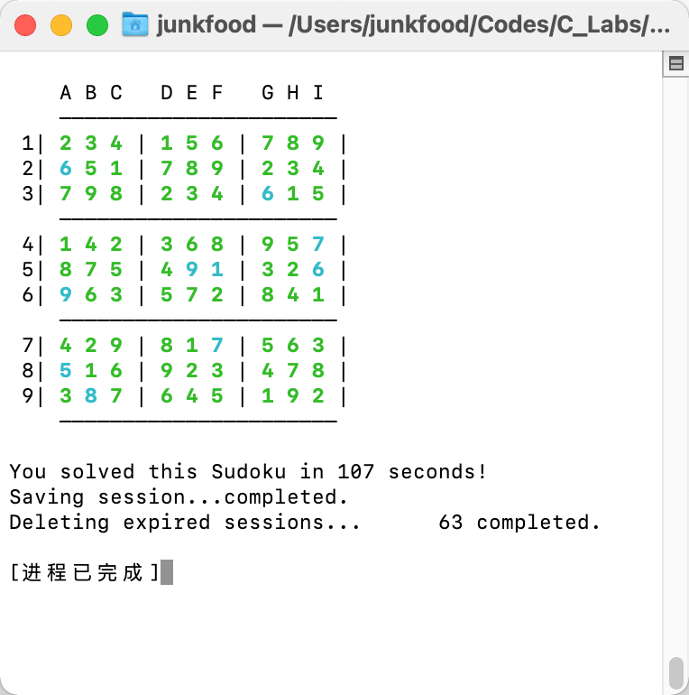

# 任务描述与分析

> 本课程设计的基本要求为实现一个数独游戏的原型，程序可以按难易程度生成初始数独，提供冲突检测帮助，以及计时的功能。

本程序的主体是数独游戏。数独是一款填数字游戏，玩家需要在 $9\times 9$ 的盘面中，根据已有数字的提示来填入 $1-9$ 的数字，同时需要满足 $3$ 种约束条件：同一行、同一列以及同一个 $3\times 3$ 的九宫格内不能出现重复数字。

- 数独游戏的难度高低主要取决于已有提示数的多少，因此本程序使用提示数数量来作为指标量化生成数独的难度：即提示数越少，数独难度越高，反之亦然。
- 数独中每次填数都需要满足如上所述的约束条件，每次用户填入一个数字时，都需要在当前行、当前列以及当前宫判断当前填数操作是否合法。若不合法，则应在程序中输出具体的冲突消息以供用户排查错误。
- 实现计时功能，可以记数独谜题生成的时刻为开始时刻，并在玩家解决数独谜题时将当前时刻与开始时刻相减，所得时长即为玩家完成游戏的时长。

值得注意的是数独谜题应当有且仅有一个解。


# 程序算法设计

目前一种较为通用的数独生成算法为「挖洞」法，即生成一个合法的数独终盘，再将其中的一些数字删去，在删去数字的过程中不断检查当前数独，保证其始终有唯一解。

具体的分步实现步骤如下：

1. 使用 Las Vegas 随机算法在空白矩阵中填入 10 或 11 个数。

2. 使用深度优先搜索 (Depth First Search) 算法，对当前矩阵进行数独填数，生成一个合法的数独终盘。

3. 使用 Las Vegas 随机算法在当前数独终盘随机选取数字，将其删除并改写成 $1-9$ 内的其他数字。

4. 使用上述的求解程序对改写后矩阵进行求解：
   - 若改写后数独仍然有解，则说明删去此处数字会导致数独多解，将此处填回原数并回到第 3 步寻找下一位置。
   - 若改写成**其他所有可能数字**后数独均无解，说明删去此处数字，数独仍然有唯一解，则将此处数字删除并回到第 3 步寻找下一位置，直到「挖空」数达到目标数值。
   

```flow
st=>start: 随机填数
op1=>operation: DFS 求解生成数独终盘
op3=>operation: 随机挖空并改写为其他数字
op4=>operation: 此处挖空合法
op6=>operation: 此处挖空导致多解，填回原数
cond=>condition: DFS验证是否合法
st->op1->op3->cond
cond(yes)->op6(left)->op3
cond(no)->op4(right)->op3
```


# 程序算法实现

本程序由 C 语言进行实现。本程序主要分为 4 个模块：命令行用户交互、数独求解函数、数独生成算法以及界面绘制。其中命令行用户交互、数独求解函数与数独生成算法在主程序 `sudoku.c` 中实现，数独界面的绘制在 `painter.c` 中实现。

## 命令行用户交互

程序中主要需要和用户交互的功能有两处：在游戏开始时输入数独难度，以及游戏过程中进行数独的填数或删除。

游戏开始时，首先调用 `Start()` 函数，输出用户指引文字，指引用户输入生成数独难度等级 (0-5) ，若输入等级数合法则返回，不合法则输出报错信息，并进行递归调用，直至用户输入合法数字为止。

```c
int Start()
{
    printf("" REVERSE "Soduku" NONE "\nInput the level of Puzzle:\n");
    printf("[0]Very Easy [1]Easy [2]Normal [3]Hard [4]Very Hard\n");
    int n;
    scanf("%d", &n);
    if (n >= 0 && n <= 4)
    {
        printf("Generate Sudoku Puzzle for Difficulty [%s]\n", difficulty[n]);
        return n;
    }
    else
    {
        clear();
        printf("Invalid Input!\n");
        return Start();
    }
}
```

在生成数独谜题后，使用 `painter.c` 中的 `draw()` 函数绘制当前数独矩阵，同时开启一个循环，其停止条件为计数器 `progress`，循环体内调用 `InputNumber()` 函数，提示用户进行操作，提供格式示例，并在成功进行操作后将其返回值加于计数器 `progress`。


用户输入一个字符串之后，`InputNumber()` 函数依次进行如下判断：

1. 判断操作字符串是否为合法的操作字符串，即格式为「合法字母列号 + 合法数字行号 + 操作」长度为 3 的字符串。
   - 形如 `A23` 的操作字符串将数字 $3$ 插入至第 $A$ 列第 $2$ 行
   - 形如 `C4D` 的操作字符串将第 $C$ 列第 $4$ 行的数字删除
   
2. 判断操作类型，即判断字符串的第 3 个字符为 $1-9$ 的合法数字（插入）或 $D$（删除）。

3. 判断目标位置是否可以进行该操作。
   - 若为插入操作，则判断该位置是否非空，插入该数字是否合法
   - 若为删除操作，则判断该位置是否非空，或为无法删除的提示数
   
4. 完成插入操作或删除操作后，函数返回 `-1` 或 `1  ` 表示成功插入或删除一个数字，在主函数中加于 `progress` 计数器上，若以上任一判断不合法，则输出报错信息并递归调用 `InputNumber()` 函数提示用户重新输入操作。

   

```c
int InputNumber()
{
    printf("\nInput the Position with an Operation:\n");
    printf("Insert: A23 put 3 into Row A Column 2\n");
    printf("Delete: C4D remove number from Row C Column 4\n");
    char c[100];
    scanf("%3s", c);
    if (!strcmp(c, "IDK"))
    {
        printf("Print The Answer\n");
        draw(tempMatrix);
        return InputNumber();
    }
    int n0, n1, n2;
    n0 = c[0] - 'A' + 1;
    n1 = c[1] - '0';
    n2 = c[2] - '0';
    if (n0 < 1 || n0 > 9 || n1 < 1 || n1 > 9)
    {
        clear();
        draw(Matrix);
        printf("Invalid Input!\n");
        return InputNumber();
    }
    if (c[2] == 'D')
    {
        if (!Matrix[n1][n0])
        {
            clear();
            draw(Matrix);
            printf("Position %c%d is empty.\n", c[0], n1);
            return InputNumber();
        }
        else if (Matrix[n1][n0] > 0)
        {
            clear();
            draw(Matrix);
            printf("Number of Position %c%d cannot be clear.\n", c[0], n1);
            return InputNumber();
        }
        clear();
        clearNumber(n1, n0);
        draw(Matrix);
        return 1;
    }
    else if (n2 >= 1 && n2 <= 9)
    {
        clear();
        if (Matrix[n1][n0])
        {
            draw(Matrix);
            printf("Position %c%d has already a number.\n", c[0], n1);
            return InputNumber();
        }
        else if (checkLegalWithMsg(n1, n0, n2))
        {
            fillNumber(n1, n0, -n2);
            draw(Matrix);
            return -1;
        }
        else
        {
            draw(Matrix);
            return InputNumber();
        }
    }
    else
    {
        clear();
        draw(Matrix);
        printf("Invalid Input!\n");
        return InputNumber();
    }
}
```

与求解函数使用的 `checkLegal()` 函数不同，在命令行用户交互中，本程序设计了带有冲突检测信息的 `checkLegalWithMsg()` 函数，可以根据所插入位置的行、列以及宫输出冲突报错信息，帮助用户进行错误排查。

```c
//检查输入数字是否合法，若不合法则输出报错信息
int checkLegalWithMsg(int x, int y, int value)
{
    int res = 1;
    int blockNum = (x - 1) / 3 * 3 + (y - 1) / 3 + 1;
    if (block[blockNum][value])
    {
        printf("Block %d has already a/an %d.\n", blockNum, value);
        res = 0;
    }
    if (row[y][value])
    {
        printf("Row %c has already a/an %d.\n", y + 'A' - 1, value);
        res = 0;
    }
    if (column[x][value])
    {
        printf("Column %d has already a/an %d.\n", x, value);
        res = 0;
    }
    return res;
}
```


## 数独求解函数

数独实质上是一个 $9\times 9$ 的数字矩阵，因此程序使用一个二维数组 `Matrix[][]` 进行储存。为了实现数独所要求的行、列以及宫的约束条件，定义三个 $10*10$ 大小的二维 `int` 型数组 `column`、`row` 以及 `block`。当试图放置一个数字时，程序对三个数组表示指定位置指定数字的变量进行检查，若检查通过则将三个数组的指定变量置 1，删除数字同理。

```c
#include "sudoku.h"

int Matrix[10][10];
int tempMatrix[10][10];
int block[10][10], row[10][10], column[10][10], mark[10][10];

int checkLegal(int x, int y, int value)
{
    int blockNum = (x - 1) / 3 * 3 + (y - 1) / 3 + 1;
    return !(column[x][value] || row[y][value] || block[blockNum][value]);
}

void fillNumber(int x, int y, int value)
{
    int blockNum = (x - 1) / 3 * 3 + (y - 1) / 3 + 1;
    Matrix[x][y] = value;
    if (value < 0)
        value = -value;
    column[x][value] = 1;
    row[y][value] = 1;
    block[blockNum][value] = 1;
}

void clearNumber(int x, int y)
{
    int blockNum = (x - 1) / 3 * 3 + (y - 1) / 3 + 1;
    int value = Matrix[x][y];
    if (value < 0)
        value = -value;
    column[x][value] = 0;
    row[y][value] = 0;
    block[blockNum][value] = 0;
    Matrix[x][y] = 0;
}

int checkLegalWithMsg(int x, int y, int value)
{
    int res = 1;
    int blockNum = (x - 1) / 3 * 3 + (y - 1) / 3 + 1;
    if (block[blockNum][value])
    {
        printf("Block %d has already a/an %d.\n", blockNum, value);
        res = 0;
    }
    if (row[y][value])
    {
        printf("Row %c has already a/an %d.\n", y + 'A' - 1, value);
        res = 0;
    }
    if (column[x][value])
    {
        printf("Column %d has already a/an %d.\n", x, value);
        res = 0;
    }
    return res;
}
```

程序中使用的数独求解函数使用深度优先搜索 (DFS) 算法实现，即在每个位置遍历每个数字依次试填，并进行深度优先的递归搜索，若无法得到结果则进行回溯，继续下一种情况搜索的求解。

```c
void solveSudoku(int i, int j, int FillOut)
{
  //到达终点则标记
    if (i == 10)
        flag = 1;
    if (flag)
        return;
    if (Matrix[i][j])
    {
        //判断是否到达当前行终点
        if (j == 9)
            solveSudoku(i + 1, 1, FillOut);
        else
            solveSudoku(i, j + 1, FillOut);
    }
    else
    {
        for (int k = 1; k <= 9; k++)
        {
            if (checkLegal(i, j, k))
            {
                fillNumber(i, j, k);
                if (j == 9)
                    solveSudoku(i + 1, 1, FillOut);
                else
                    solveSudoku(i, j + 1, FillOut);
                if (flag && FillOut)
                    return;
                clearNumber(i, j);
            }
        }
    }
}
```


## 数独生成算法

数独生成算法已在本文的第二部分有详细的介绍，即「挖洞」法，程序使用 Las Vegas 随机算法与 DFS 深度优先搜索算法生成一个合法的数独终盘，再将其中的一些数字删去，在删去数字的过程中不断使用 DFS 深度优先搜索算法检查当前数独，保证其始终有唯一解。

具体的代码实现如下：

1. 初始化所有数组，记录下生成数独的时间 `tt1`，当数独解答完毕时记录下此时时间 `tt2`，两者相减即为程序运行时间。

2. 使用 Las Vegas 随机算法在空白矩阵中填入 10 或 11 个数，随机数使用 `stdlib.h` 库中的  `srand()` 与 `rand()` 函数生成（封装在 `getRandom()` 函数内）。

3. 使用深度优先搜索 (Depth First Search) 算法，对当前矩阵进行数独填数，生成一个合法的数独终盘。

4. 使用 Las Vegas 随机算法在当前数独终盘随机选取数字，将其删除并改写成 $1-9$ 内的其他数字。

5. 使用上述的求解程序对改写后矩阵进行求解：
   - 若改写后数独仍然有解，则说明删去此处数字会导致数独多解，将此处填回原数并回到上一步寻找下一位置。

   - 若改写成**其他所有可能数字**后数独均无解，说明删去此处数字，数独仍然有唯一解，则将此处数字删除并回到上一步寻找下一位置，直到「挖空」数达到目标数值。

为提高数独谜题生成程序的效率，减少无效计算，函数引入了一个计数器 `cnt`，记录当前已经试图删去的数字，若计数达到 $81$（即所有位置都被访问过），则说明当前数独已经无法再进行挖空操作并退出，函数至多调用 $81$ 次 DFS 算法求解。记一次 DFS 求解的时间复杂度为 $O(V*E)$，则生成一个数独的时间复杂度为 $O(81*V*E)$。

此种搜索剪枝方法使得程序可以较为稳定快速地生成一个数独终盘，但也有其缺点所在。由于程序在挖空后没有进行回溯，导致生成的数独谜题在前几次随机挖空后，数独谜题最终形态实际上已经被决定，而无法进行更深入的递归回溯搜索以生成极端难度的数独谜题。

```c
int generateSudoku()
{
    tt1 = time(NULL);
    srand(tt1);
    memset(Matrix, 0, sizeof(Matrix));
    memset(row, 0, sizeof(row));
    memset(block, 0, sizeof(block));
    memset(column, 0, sizeof(column));
    memset(mark, 0, sizeof(mark));
    flag = 0;
    int num = 10;
    int i, j, newValue;
    while (num)
    {
        i = getRandom(), j = getRandom();
        if (!Matrix[i][j])
        {
            newValue = getRandom();
            if (checkLegal(i, j, newValue))
            {
                fillNumber(i, j, newValue);
                num--;
            }
        }
    }
    solveSudoku(1, 1, 1);
    memcpy(tempMatrix, Matrix, sizeof(Matrix));
    return 1;
}

int generatePuzzle(int progress)
{
    int x, y, temp, cnt = 0;
    while (progress)
    {
        if (cnt == 81)
            return 1;
        x = getRandom(), y = getRandom();
        if (!Matrix[x][y] || mark[x][y])
            continue;
        temp = Matrix[x][y];
        clearNumber(x, y);
        for (int i = 1; i <= 9; i++)
        {
            flag = 0;
            if (i == temp)
                continue;
            if (checkLegal(x, y, i))
            {
                fillNumber(x, y, i);
                solveSudoku(1, 1, 0);
                if (flag)
                {
                    clearNumber(x, y);
                    fillNumber(x, y, temp);
                    break;
                }
                else
                    clearNumber(x, y);
            }
        }
        if (!flag)
        {
            progress--;
            cnt++;
        }
        else
        {
            mark[x][y] = 1;
            cnt++;
        }
    }
    return 1;
}
```


## 数独界面绘制

数独界面绘制的主要实现部分为 `painter.c` 中的 `draw()` 绘制函数以及 `clear()` 清屏函数。此外还在 `painter.h` 中定义了使用 ANSI 编码来控制输出字符格式的宏，将空白格、提示数以及用户填入的数字以不同样式进行输出，使得绘制的数独界面更为美观并且用户友好。代码请见第 4 部分。


# 程序运行截图

截图分别对应以下场景：

1. 数独的开始界面以及数独谜题的生成。

2. 当操作不合法时，数独在程序窗口内打印冲突提示消息。

3. 数独谜题完成，程序输出用户解决此数独使用的时间。

   










# 程序源代码

 ```c
 //
 // sudoku.c
 // Created by ? on 2021/11/17.
 //
 
 #include "sudoku.h"
 
 int Matrix[10][10];
 int tempMatrix[10][10];
 int block[10][10], row[10][10], column[10][10], mark[10][10];
 int levelNum[5] = {10, 20, 30, 42, 64};
 char difficulty[5][20] = {"Very Easy", "Easy", "Normal", "Hard", "Very Hard"};
 int flag = 0;
 int level, progress;
 time_t tt1, tt2;
 
 int main()
 {
     clear();
     level = Start();
     generateSudoku();
     progress = levelNum[level];
     generatePuzzle(progress);
     draw(Matrix);
     while (progress)
     {
         progress += InputNumber();
     }
     tt2 = time(NULL);
     printf("\nYou solved this Sudoku in %ld seconds!\n", tt2 - tt1);
     return 0;
 }
 //生成数独终盘
 int generateSudoku()
 {
     tt1 = time(NULL);
     srand(tt1);
     memset(Matrix, 0, sizeof(Matrix));
     memset(row, 0, sizeof(row));
     memset(block, 0, sizeof(block));
     memset(column, 0, sizeof(column));
     memset(mark, 0, sizeof(mark));
     flag = 0;
     int num = 10;
     int i, j, newValue;
     while (num)
     {
         i = getRandom(), j = getRandom();
         if (!Matrix[i][j])
         {
             newValue = getRandom();
             if (checkLegal(i, j, newValue))
             {
                 fillNumber(i, j, newValue);
                 num--;
             }
         }
     }
     solveSudoku(1, 1, 1);
     memcpy(tempMatrix, Matrix, sizeof(Matrix));
     return 1;
 }
 int getRandom()
 {
     return rand() % 9 + 1;
 }
 //求解数独程序，FillOut标记表示是否在求解成功后将数独填充
 void solveSudoku(int i, int j, int FillOut)
 {
     if (i == 10)
         flag = 1;
     if (flag)
         return;
     if (Matrix[i][j])
     {
         if (j == 9)
             solveSudoku(i + 1, 1, FillOut);
         else
             solveSudoku(i, j + 1, FillOut);
     }
     else
     {
         for (int k = 1; k <= 9; k++)
         {
             if (checkLegal(i, j, k))
             {
                 fillNumber(i, j, k);
                 if (j == 9)
                     solveSudoku(i + 1, 1, FillOut);
                 else
                     solveSudoku(i, j + 1, FillOut);
                 if (flag && FillOut)
                     return;
                 clearNumber(i, j);
             }
         }
     }
 }
 //生成数独谜题
 int generatePuzzle(int progress)
 {
     int x, y, temp, cnt = 0;
     while (progress)
     {
         if (cnt == 81)
             return 1;
         x = getRandom(), y = getRandom();
         if (!Matrix[x][y] || mark[x][y])
             continue;
         temp = Matrix[x][y];
         clearNumber(x, y);
         for (int i = 1; i <= 9; i++)
         {
             flag = 0;
             if (i == temp)
                 continue;
             if (checkLegal(x, y, i))
             {
                 fillNumber(x, y, i);
                 solveSudoku(1, 1, 0);
               //flag若为真 则说明当前数独有解
                 if (flag)
                 {
                     clearNumber(x, y);
                     fillNumber(x, y, temp);
                     break;
                 }
                 else
                     clearNumber(x, y);
             }
         }
         if (!flag)
         {
             progress--;
             cnt++;
         }
         else
         {
             mark[x][y] = 1;
             cnt++;
         }
     }
     return 1;
 }
 //程序开始，用户输入难度等级
 int Start()
 {
     printf("" REVERSE "Soduku" NONE "\nInput the level of Puzzle:\n");
     printf("[0]Very Easy [1]Easy [2]Normal [3]Hard [4]Very Hard\n");
     int n;
     scanf("%d", &n);
     if (n >= 0 && n <= 4)
     {
         printf("Generate Sudoku Puzzle for Difficulty [%s]\n", difficulty[n]);
         return n;
     }
     else
     {
         clear();
         printf("Invalid Input!\n");
         return Start();
     }
 }
 //用户输入操作
 int InputNumber()
 {
     printf("\nInput the Position with an Operation:\n");
     printf("Insert: A23 put 3 into Row A Column 2\n");
     printf("Delete: C4D remove number from Row C Column 4\n");
     char c[100];
     scanf("%3s", c);
     if (!strcmp(c, "IDK"))
     {
         printf("Print The Answer\n");
         draw(tempMatrix);
         return InputNumber();
     }
     int n0, n1, n2;
     n0 = c[0] - 'A' + 1;
     n1 = c[1] - '0';
     n2 = c[2] - '0';
     if (n0 < 1 || n0 > 9 || n1 < 1 || n1 > 9)
     {
         clear();
         draw(Matrix);
         printf("Invalid Input!\n");
         return InputNumber();
     }
     if (c[2] == 'D')
     {
         if (!Matrix[n1][n0])
         {
             clear();
             draw(Matrix);
             printf("Position %c%d is empty.\n", c[0], n1);
             return InputNumber();
         }
         else if (Matrix[n1][n0] > 0)
         {
             clear();
             draw(Matrix);
             printf("Number of Position %c%d cannot be clear.\n", c[0], n1);
             return InputNumber();
         }
         clear();
         clearNumber(n1, n0);
         draw(Matrix);
         return 1;
     }
     else if (n2 >= 1 && n2 <= 9)
     {
         clear();
         if (Matrix[n1][n0])
         {
             draw(Matrix);
             printf("Position %c%d has already a number.\n", c[0], n1);
             return InputNumber();
         }
         else if (checkLegalWithMsg(n1, n0, n2))
         {
             fillNumber(n1, n0, -n2);
             draw(Matrix);
             return -1;
         }
         else
         {
             draw(Matrix);
             return InputNumber();
         }
     }
     else
     {
         clear();
         draw(Matrix);
         printf("Invalid Input!\n");
         return InputNumber();
     }
 }
 
 int checkLegal(int x, int y, int value)
 {
     int blockNum = (x - 1) / 3 * 3 + (y - 1) / 3 + 1;
     return !(column[x][value] || row[y][value] || block[blockNum][value]);
 }
 //向矩阵中填入数字并添加标记
 void fillNumber(int x, int y, int value)
 {
     int blockNum = (x - 1) / 3 * 3 + (y - 1) / 3 + 1;
     Matrix[x][y] = value;
     if (value < 0)
         value = -value;
     column[x][value] = 1;
     row[y][value] = 1;
     block[blockNum][value] = 1;
 }
 //清除矩阵中数字及其标记
 void clearNumber(int x, int y)
 {
     int blockNum = (x - 1) / 3 * 3 + (y - 1) / 3 + 1;
     int value = Matrix[x][y];
     if (value < 0)
         value = -value;
     column[x][value] = 0;
     row[y][value] = 0;
     block[blockNum][value] = 0;
     Matrix[x][y] = 0;
 }
 //检查输入数字是否合法，若不合法则输出报错信息
 int checkLegalWithMsg(int x, int y, int value)
 {
     int res = 1;
     int blockNum = (x - 1) / 3 * 3 + (y - 1) / 3 + 1;
     if (block[blockNum][value])
     {
         printf("Block %d has already a/an %d.\n", blockNum, value);
         res = 0;
     }
     if (row[y][value])
     {
         printf("Row %c has already a/an %d.\n", y + 'A' - 1, value);
         res = 0;
     }
     if (column[x][value])
     {
         printf("Column %d has already a/an %d.\n", x, value);
         res = 0;
     }
     return res;
 }
 
 ```

```c
//
// sudoku.h
// Created by ? on 2021/11/17.
//

#include <time.h>
#include <stdlib.h>
#include "painter.h"
#include <string.h>
int getRandom();
int generateSudoku();
void solveSudoku(int, int, int);
int generatePuzzle(int);
int Start();
int InputNumber();
int invalidInput(int());
int checkLegal(int, int, int);
int checkLegalWithMsg(int, int, int);
void fillNumber(int, int, int);
void clearNumber(int, int);
```

```c
//
// painter.h
// Created by ? on 2021/11/17.
//

#ifndef DATASTRUCTURE_PAINTER_H
#define DATASTRUCTURE_PAINTER_H

#include <stdio.h>

#define GREEN "\e[1;32m"
#define BLANK "\e[1;30m"
#define NONE "\e[0m"
#define CLEAR "e[1;1He[2J"
#define UNDERLINE "\e[4m"
#define CYAN "\e[1;36m"
#define BLUE "\e[1;34m"
#define REVERSE "\e[7m"

void draw(int Matrix[10][10]);

void clear();
#endif //DATASTRUCTURE_PAINTER_H

```

```c
//
// painter.c
// Created by ? on 2021/11/17.
//

#include "painter.h"

void clear()
{
    printf("\e[1;1H\e[2J");
}

void draw(int Matrix[10][10])
{
    int cnt = 0;
    printf("\n   ");
    for (int i = 1; i <= 9; i++)
    {
        printf("%2c", 'A' + i - 1);
        if (i % 3 == 0)
            printf("  ");
    }
    printf("\n    ——————————————————————\n");
    for (int i = 1; i <= 9; i++)
    {
        printf("%2d|", i);
        for (int j = 1; j <= 9; j++)
        {
          /*
          提示数使用绿色输出
          用户填入数字(使用负数进行标记)使用青色输出
          空白处输出下划线
          */
            if (Matrix[i][j] > 0)
                printf("" GREEN "%2d" NONE "", Matrix[i][j]);
            else if (Matrix[i][j] < 0)
                printf("" CYAN "%2d" NONE "", -Matrix[i][j]);
            else
            {
                printf(" " UNDERLINE " " NONE "");
                cnt++;
            }

            if (j % 3 == 0)
                printf(" |");
        }
        printf("\n");
        if (i % 3 == 0)
            printf("    ——————————————————————\n");
    }
    //printf("total :%d \n", 81 - cnt);
}
```


# 参考文献

[1]薛源海,蒋彪彬,李永卓,闫桂峰,孙华飞.基于“挖洞”思想的数独游戏生成算法[J].数学的实践与认识,2009,39(21):1-7.
